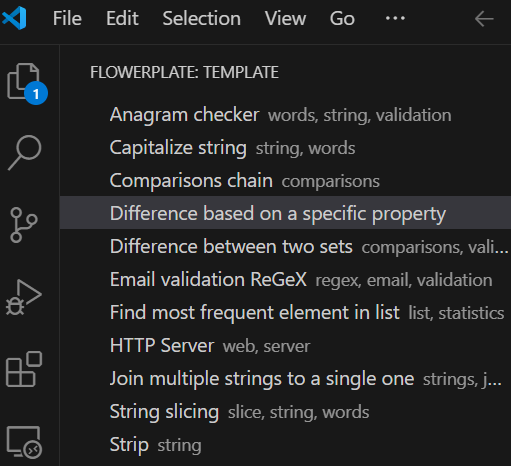

# Flowerplate

Bloom by adding Python boilerplate templates directly in VS Code.

## Features

- **Activity bar view** “Flowerplate” for quick access
- **Tree view** of templates showing name, tags and a tooltip preview
- **Insert templates** at the cursor with one click
- **Context-aware messages**:
  - No file opened
  - Only supports Python for now
  - No templates available
  - Template load failures
- **Future roadmap**: 
    - HTML display of templates
    - drag & drop
    - search/browse UI
    - smart suggestions  

## Requirements

If you plan to develop or debug the extension, you’ll need:

- **Visual Studio Code** ≥ 1.99.0  
- **Node.js** and **npm** (for building & packaging)  
- Running only on **Python** files at the moment

## Extension Settings

This extension does not yet expose any user-configurable settings.
However, eventually, you will be able to:
- set the variables on the templates yourself
- create your own templates
- disable or enable imports

## Known Issues

- 📋 Drag-and-drop support is not available in this version  
- 🐛 JSON parsing errors for malformed template files are logged to the console but not surfaced in the UI  

## Release Notes

### 0.1.0

- Initial release  
- Tooltip previews showing first 20 lines of the template
- Tree view scaffold and click to insert-template  
- Status messages for context  

### 0.2.0

- Ability to edit already existing template for yourself

## Following extension guidelines

Make sure you’ve reviewed and complied with the VS Code extension best practices:

* [Extension Guidelines](https://code.visualstudio.com/api/references/extension-guidelines)

**Enjoy!**  
